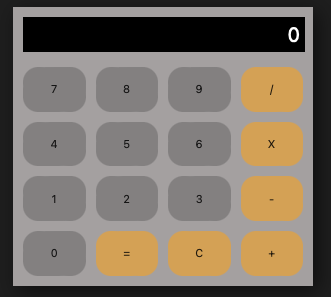

# Calculadora Basica

El presente proyecto es una aplicacion para realizar calculos basicos (sumar, restar, multiplicar y dividir).

Mediante el uso de la funcion `readButton` estaremos leyendo el valor de cada botón presionado. En caso que se presione un boton numérico, su valor se irá mostrando en la pantalla de la calculadora. Por el contrario, si el boton presionado corresponde a una operación, el valor numerico ingresado previamente será almacenado internamente en un array llamado `calcs` así como tambien se almacenará la operacion presionada y se limpiara el campo de texto para que el usuario pueda ingresar el segundo valor de la operación. Cada operacion es evaluada dentro de un `switch` statement.